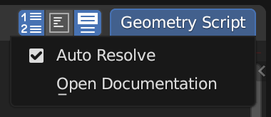

A scripting API for Blender's Geometry Nodes:

<table>
<tbody>
<tr>

<td>

```python
from geometry_script import *

@tree("Repeat Grid")
def repeat_grid(geometry: Geometry, width: Int, height: Int):
    g = grid(
        size_x=width, size_y=height,
        vertices_x=width, vertices_y=height
    ).mesh_to_points()
    return g.instance_on_points(instance=geometry)
```

</td>
<td>


</td>
</tr>
</tbody>
</table>

## Installation
1. [Download the source code](https://github.com/carson-katri/geometry-script/archive/refs/heads/main.zip)
2. Open *Blender* > *Preferences* > *Add-ons*
3. Choose *Install...* and select the downloaded ZIP file

## What is Geometry Script?
*Geometry Script* is a robust yet easy to use Python API for creating Geometry Nodes with code.

At a certain point, Geometry Node trees become unmanagably large. Creating node trees in Python enables quicker editing and reorganization of large, complex trees.

*Geometry Script* has all of the performance and capabilities of Geometry Nodes, but in a more managable format. The scripts are converted directly to Geometry Node trees making them easy to tweak for others unfamiliar with scripting.

## How it Works
When the script is run, *Geometry Script* builds a node tree based on the functions you call.

Take this script for example:

```python
from geometry_script import *
@tree
def example(geometry: Geometry):
    my_cube = cube(size=(1, 2, 3))
    return my_cube
```

Let's break it down line by line:

1. Import all of the types and functions available in *Geometry Script*.
2. The `@tree(...)` decorator marks this function as a node tree builder. If you pass a name to the decorator it will use that as the name of the node tree. Otherwise, it will use the name of the function it is on. Any marked function will be built automatically when the script is run.
3. All arguments used in the function must be annotated with a type, such as `Geometry`, `Float`, `Vector`, etc. Each of these arguments is added to the *Group Input* node. They can be configured on the *Geometry Node* modifier.
4. The `cube` function maps to the *Cube* node. When you call this function, it creates that node in the tree, and returns the output socket. In this case, the output socket is stored in the variable `my_cube`.
5. Whatever is returned from the function will be connected to the *Group Output* node. You must return at least one `Geometry` type.

### Sockets
The types used as arguments in a *Geometry Script* are typically not native Python types. Instead, they are one of the special socket types:

* `Geometry`
* `Float`
* `Int`
* `Vector`
* ...

These types do not represent concrete values. Instead, they represent different types of sockets in the node tree:

```python
native_integer: int = 5 # this is equal to the number 5
socket_integer: Int = Int(value=5) # this is the output socket of an `Integer` node with the value `5`
```

Because these values represent sockets and not concrete values, you cannot access their underlying value from the script:

```python
print(native_integer) # 5
print(socket_integer) # <geometry_script.types.Int object at 0x0>
```

You can, however, modify the value with common math operations or by calling other node functions:

```python
socket_integer * 2 # creates a `Math` node that multiplies the `Integer` node by 2
socket_integer = random_value(data_type='INT', seed=socket_integer) # use the `Integer` node as the seed for a new random integer
```

### Generators
Tree builder functions can also be generators:

```python
@tree
def cube_and_cylinder():
    yield cube()
    yield cylinder().mesh
```

Because all of the generated values are `Geometry` types, they will be automatically joined with a *Join Geometry* node and sent as the output.

You can `yield` other types as well, however:

```python
@tree
def cube_cylinder_and_int():
    yield cube() # The first output of a Geometry Nodes tree must be `Geometry`
    yield cylinder()
    yield 5
```

This will create three outputs, one for the cube, one for the cylinder, and one for an *Integer* node with the value `5`.

### Default Values
```python
@tree
def cube_with_height(height: Float = 0.5):
    return cube(size=combine_xyz(z=height))
```
The value `0.5` will show as the default in the Geometry Nodes modifier.

### Available Nodes
Every node available in your current version of Blender can be used as a function. The name will be converted to snake case:
```python
Some Node Name -> some_node_name
```
Any inputs will also be converted to snake case:
```python
some_node_name(some_input=5, some_vector=(1, 2, 3))
```

### External Editing
Blender's *Text Editor* leaves a lot to be desired. Editing scripts in an IDE like Visual Studio Code can provide a nicer experience with code completion, type hints, and more.

To open an external Python file:

1. Select the open icon in Blender's Text Editor
2. Navigate to the file, then open the sidebar (click the gear icon or press *N*) and uncheck *Make Internal*


3. Click *Open Text*
4. At the top of the Text Editor, enable Geometry Script's *Auto Resolve* feature. This will make sure the opened file automatically accepts any changes made in an external editor.



5. *(Optional)* Enable *Text* > *Live Edit* to automatically rebuild the Geometry Node tree every time the file is changed.


### Documentation
Documentation and typeshed files are automatically generated when you install the add-on. You can find instructions for using them with your IDE in the add-on preferences.

