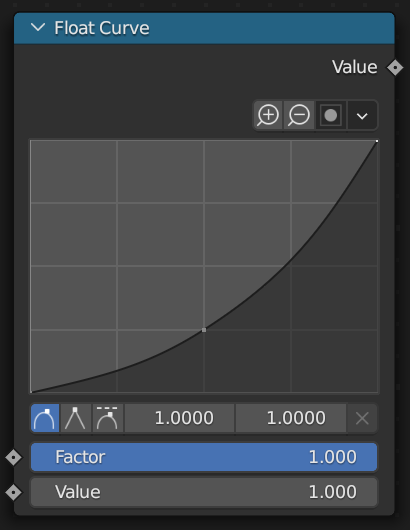

# Curves

Some nodes, such as *Float Curve* take a curve as a property. You can create a curve with the `Curve` class.

```python
float_curve(
    mapping=Curve(
        Point(0, 0),
        Point(0.5, 0.25),
        Point(1, 1, HandleType.VECTOR), # Optionally specify a handle type, such as `AUTO`, `VECTOR`, or `AUTO_CLAMPED`.
    )
)
```



You can also pass the points as a list to `Curve`.

```python
points = [Point(0, 0), Point(1, 1)]
float_curve(
    mapping=Curve(points)
)
```

If a node has multiple curve properties, such as the *Vector Curves* node, pass a list of curves to the node.

```python
vector_curves(
    mapping=[x_curve, y_curve, z_curve]
)
```