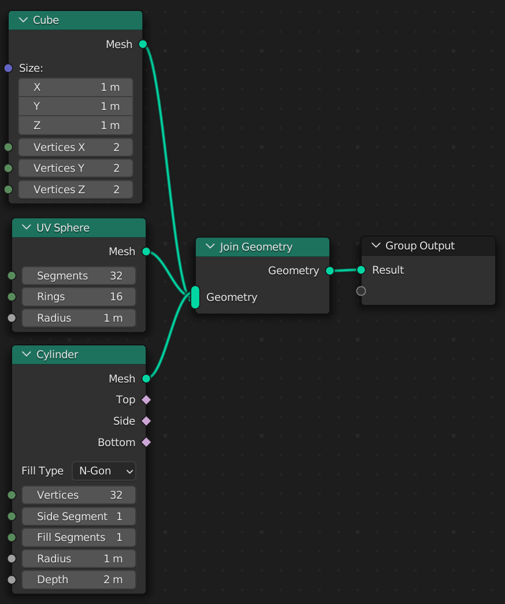

# Generators

Python has support for [generators](https://wiki.python.org/moin/Generators) using the `yield` keyword.

Geometry Script tree functions can be represented as generators to output multiple values. If every generated value is `Geometry`, the values are automatically connected to a *Join Geometry* node and output as a single mesh.

```python
@tree("Primitive Shapes")
def primitive_shapes():
    yield cube()
    yield uv_sphere()
    yield cylinder().mesh
```



However, if any of the outputs is not `Geometry`, separate sockets are created for each output.

```python
@tree("Primitive Shapes and Integer")
def primitive_shapes():
    yield cube()
    yield uv_sphere()
    yield cylinder().mesh
    yield 5 # Not a geometry socket type
```


> The first output is always displayed when using a *Geometry Nodes* modifier. Ensure it is a `Geometry` socket type, unless you are using the function as a node group.