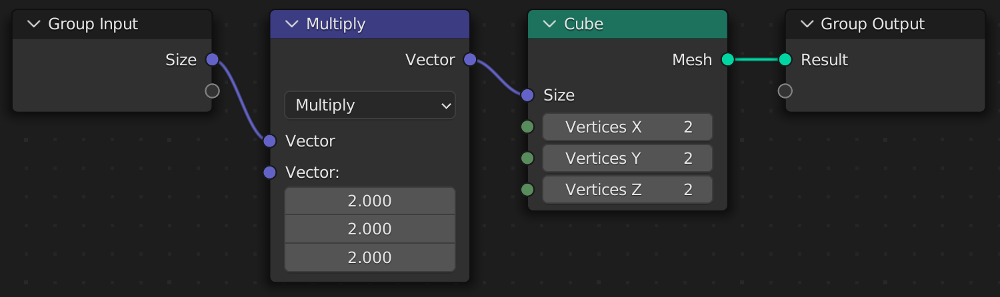
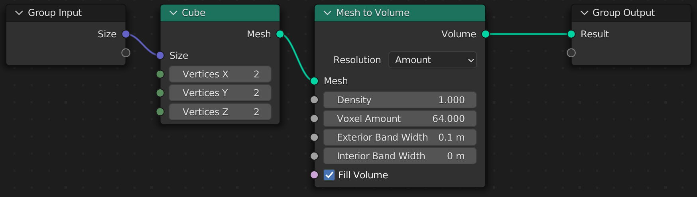

# Sockets
Because scripts are converted to Geometry Node trees, you typically cannot use default Python types as arguments. In some cases, they will be automatically converted for you, but in general you will be dealing with socket types.

## What is a socket?
A socket is any input or output on a node. Take the *Cube* node for example:


This node has 4 input sockets, and 1 output socket.

* Input Sockets
    * Size: `Vector`
    * Vertices X: `Int`
    * Vertices Y: `Int`
    * Vertices Z: `Int`
* Output Sockets
    * Mesh: `Geometry`

A socket does not represent a value itself. For example, the `Size` socket does not necessarily represent the value `(1, 1, 1)`. Instead, it can be connected to another node as an input, giving it a dynamic value.

When we write scripts, we typically deal with socket types, not concrete values like `(1, 1, 1)`. Take this script for example:

```python
@tree("Cube Tree")
def cube_tree(size: Vector):
    return cube(size=size)
```

The `size` argument creates a input socket with the type `Vector`. This is then connected to the `size` socket of the *Cube* node.


Our script does not run every time the node tree is evaluated. It only runs once to create the node tree. Therefore, we have no way of knowing what value `size` has when the script runs, because it is dynamic.

## What sockets *can* do

Sockets are great for passing values between nodes. A socket type like `Geometry` does not represent concrete vertices, edges, and faces. Instead, it represents the input or output socket of a node. This lets us use it to create connections between different nodes, by passing the output of one node to the input of another.

## What sockets *cannot* do

Sockets cannot be read for their concrete value. A `Float` socket type does not equal `5` or `10` or `3.14` to our script. It only represents the socket of a node. If you try to `print(...)` a socket, you will receive a generic reference type with no underlying value.

## Why use sockets?

You might be wondering, "if you can't access the value of a socket, what can you do with it?"

Geometry Script provides many helpful additions that make working with sockets about as easy as working with a concrete value.

## Socket Math

Socket types can be used to perform math operations. The proper *Math* node will be created automatically for you, so you can focus on writing a script and not thinking about sockets. If you use `Float` or `Int` it will create a *Math* node, and if you use a `Vector` it will create a *Vector Math* node.

```python
@tree("Cube Tree")
def cube_tree(size: Vector):
    doubled = size * (2, 2, 2) # Multiply each component by 2
    return cube(size=doubled)
```


Several common math operations are available, such as:
* Add (`socket + 2`)
* Subtract (`socket - 2`)
* Multiply (`socket * 2`)
* Divide (`socket / 2`)
* Modulo (`socket % 2`)

## Socket Comparison

Socket types can be compared with Python comparison operators. A *Compare* node will be created with the correct inputs and options specified.

```python
@tree("Cube Tree")
def cube_tree(size: Vector):
    show_cube = size > (2, 2, 2) # Check if each component is greater than 2
    return cube(size=show_cube)
```


Several common comparison operators are supported, such as:
* Equal To (`socket == 2`)
* Not Equal To (`socket != 2`)
* Less Than (`socket < 2`)
* Less Than Or Equal To (`socket <= 2`)
* Greater Than (`socket > 2`)
* Greater Than Or Equal To (`socket >= 2`)

## Vector Component Properties

While the `Vector` type does not equate to three concrete components, such as `(1, 2, 3)`, you can still access the `x`, `y`, and `z` components as sockets. A *Separate XYZ* node will be created with the correct inputs and outputs specified.

```python
@tree("Cube Tree")
def cube_tree(size: Vector):
    height = size.z # Access the Z component
    # Multiply the height by 2 but leave the other components unchanged.
    return cube(size=combine_xyz(x=size.x, y=size.y, z=height * 2))
```

For each component access, a *Separate XYZ* node is created.


## Chained Calls

Any node function can be called on a socket type. This will automatically connect the socket to the first input of the node.

```python
@tree("Cube Tree")
def cube_tree(size: Vector):
    return cube(size=size).mesh_to_volume()
```

The output of the *Cube* node (a `Geometry` socket type) is connected to the first input of the *Mesh to Volume* node.



The same script without chaining calls is written more verbosely as:

```python
@tree("Cube Tree")
def cube_tree(size: Vector):
    return mesh_to_volume(mesh=cube(size=size))
```