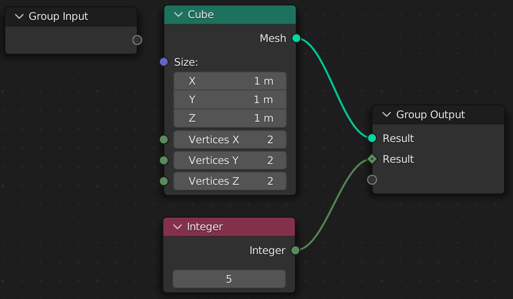
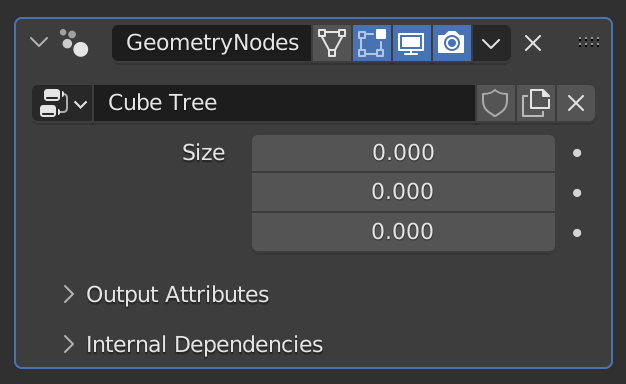

# Tree Functions

Node trees are created by decorating a function with `@tree`. Let's try creating a simple tree function.

> The code samples for the rest of the book assume you are importing all names with `from geometry_script import *`. However, if you are using a namespaced import, simply prefix the functions and types with `geometry_script` or your custom name.

```python
@tree
def cube_tree():
    ...
```

By default, the name of your function will be used as the name of the generated node tree. However, you can specify a custom name by passing a string to `@tree`:

```python
@tree("Cube Tree")
def cube_tree():
    ...
```

## Group Output
Every node tree is **required** to return `Geometry` as the first output. Let's try returning a simple cube.

```python
@tree("Cube Tree")
def cube_tree():
    return cube()
```

Here we call the `cube(...)` function, which creates a *Cube* node and connects it to the *Group Output*.


You can also return multiple values. However, `Geometry` must always be returned first for a tree to be valid.

```python
@tree("Cube Tree")
def cube_tree():
    return cube(), 5
```



By default, each output is named 'Result'. To customize the name, return a dictionary.

```python
@tree("Cube Tree")
def cube_tree():
    return {
        "My Cube": cube(),
        "Scale Constant": 5
    }
```


## Group Input
All arguments in a tree function must be annotated with a valid socket type. These types are provided by Geometry Script, and are not equivalent to Python's built-in types. Let's add a size argument to our Cube Tree.

```python
@tree("Cube Tree")
def cube_tree(size: Vector):
    return cube(size=size)
```

This creates a *Size* socket on the *Group Input* node and connects it to our cube.


The option is available on the Geometry Nodes modifier.



The available socket types match those in the UI. Here are some common ones:

* `Geometry`
* `Float`
* `Int`
* `Vector`

> You *cannot* use Python's built-in types in place of these socket types.

In the next chapter, we'll take a closer look at how socket types work, and what you can and cannot do with them.

### Default Values
You can specify a default for any argument, and it will be set on the modifier when added:

```python
@tree("Cube Tree")
def cube_tree(size: Vector = (1, 1, 1)):
    return cube(size=size)
```
