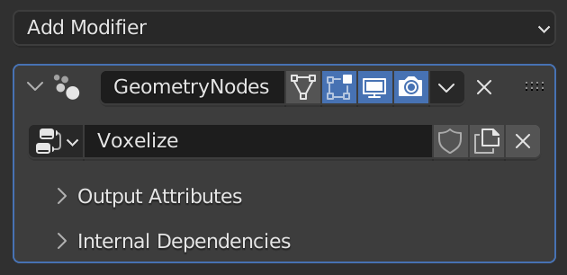

# Voxelize

This tutorial walks you through creating a script that turns any mesh into voxels.

> This tutorial requires Blender 3.4+ for the *Distribute Points In Volume* node.

## Setting Up
Create a base mesh. I'll be using a Monkey primitive.


Next, create a new script. Setting up an [external editor](../setup/external-editing.md) is recommended.

Import Geometry Script, and create a basic tree builder function. We'll add a `geometry` argument and annotate it with the `Geometry` type to receive our base mesh (in this case, a monkey).

```python
from geometry_script import *

@tree("Voxelize")
def voxelize(geometry: Geometry):
    return geometry
```

Run the script to create the tree, then add a *Geometry Nodes* modifier to your mesh and select the *Voxelize* node group.



## Arguments
Add a new argument `resolution: Float`. Give it a default value of `0.2`. This value will be used throughout the script to configure spacing and voxel density.

```python
def voxelize(geometry: Geometry, resolution: Float = 0.2):
    ...
```

## Mesh to Volume
We want to convert the mesh to a hollow volume, so only the outside of the mesh has voxel instances. This will improve the performance of our script.

Use the `mesh_to_volume` function on the base mesh to convert it to a volume.

```python
def voxelize(geometry: Geometry, resolution: Float = 0.2):
    return geometry.mesh_to_volume( # Hollow mesh volume
        interior_band_width=resolution,
        fill_volume=False
    )
```


## Volume to Points
Next, we need to create points to instance each voxel cube on. Use `distribute_points_in_volume` with the mode set to `DENSITY_GRID` to create a uniform distribution of points.

```python
def voxelize(geometry: Geometry, resolution: Float = 0.2):
    return geometry.mesh_to_volume(
        interior_band_width=resolution,
        fill_volume=False
    ).distribute_points_in_volume( # Uniform grid distribution
        mode='DENSITY_GRID',
        spacing=resolution
    )
```


## Instance Cubes
Finally, use `instance_on_points` with a cube of size `resolution` to instance a cube on each point created from our mesh.

```python
def voxelize(geometry: Geometry, resolution: Float = 0.2):
    return geometry.mesh_to_volume(
        interior_band_width=resolution,
        fill_volume=False
    ).distribute_points_in_volume(
        mode='DENSITY_GRID',
        spacing=resolution
    ).instance_on_points( # Cube instancing
        instance=cube(size=resolution)
    )
```


You can lower the resolution to get smaller, more detailed voxels, or raise it to get larger voxels.

## Final Script

```python
# NOTE: This example requires Blender 3.4+

from geometry_script import *

@tree("Voxelize")
def voxelize(geometry: Geometry, resolution: Float = 0.2):
    return geometry.mesh_to_volume(
        interior_band_width=resolution,
        fill_volume=False
    ).distribute_points_in_volume(
        mode='DENSITY_GRID',
        spacing=resolution
    ).instance_on_points(
        instance=cube(size=resolution)
    )
```

## Generated Node Tree

